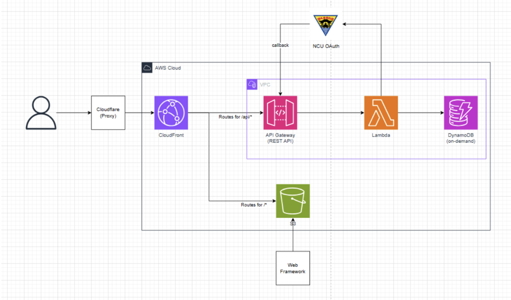

# NCUchievement

A badge collection app for NCU students. Encourage users to explore campus life, complete meaningful activities, and interact with others.

## Tech Stack

Frontend: Next.js (Typescript), React Hook Form, Redux
Backend: Python + AWS Lambda + API Gateway, DynamoDB
Integration: NCU Portal Oauth

## Cloud Architecture

